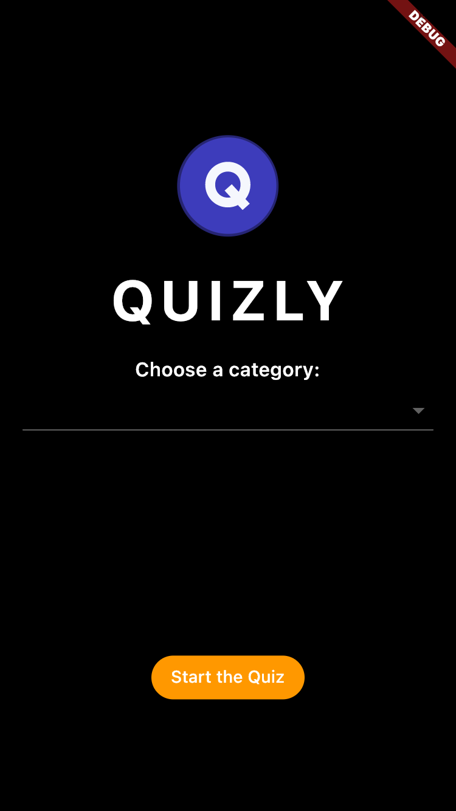
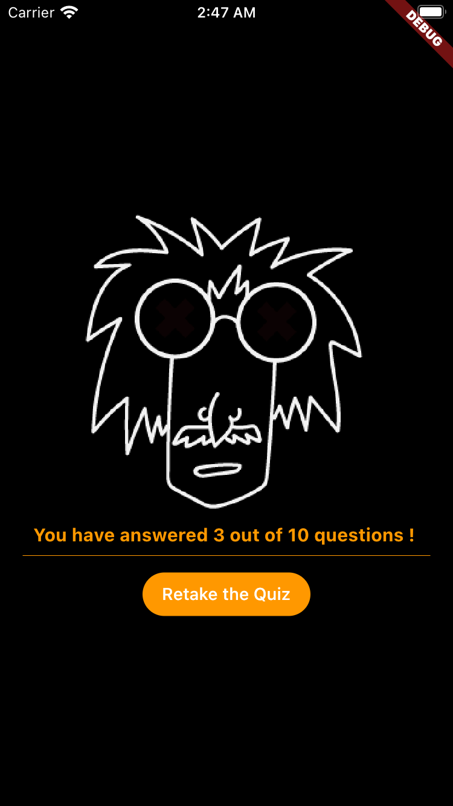
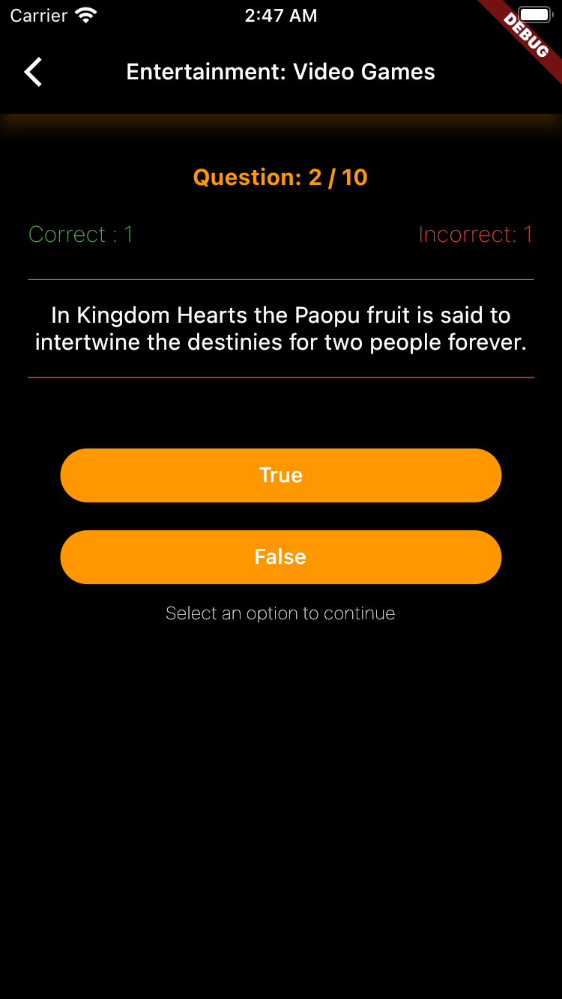
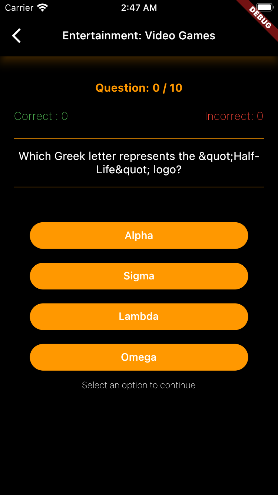

# Quizly quiz app - Clean Architecture + Mobx
A Flutter Quiz application with CLEAN Architecture and Mobx state management integrated with opentdb.

This is part of an interview. It took me about 2 days. I hope you enjoyed it and
I'm looking forward to get your feedback about it.

#features:
- State management using Mobx
- CLEAN Architecture
- Lottie Animations
- quiz API integration using HTTP (quiz from https://opentdb.com/)
- Json data (fetching and parsing)

#Screenshots

